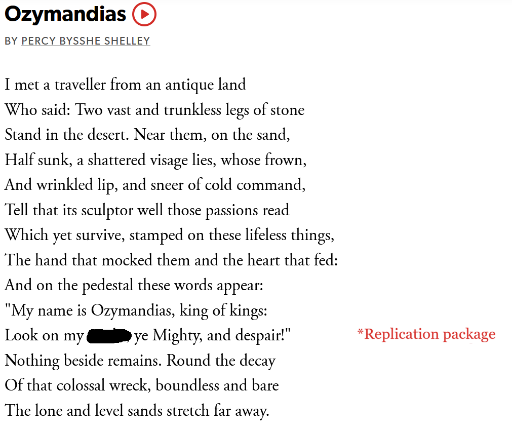

## OSF TLDR
- OSF will [stop functioning as a data repository and will phase out private projects by February 2027](https://help.osf.io/article/725-faqs)
- Users will still be able to "register study plans, publish Preprints through community-run services, and link those records to related data, materials, code, publications, and other results stored in other repositories or systems" (per the [transition FAQs](https://help.osf.io/article/725-faqs))

## What do to?
- If you used OSF to store data you might want to find another repository:
  - OSF have a [guide to choosing a new repository](https://help.osf.io/article/735-choosing-a-repository)
  - Daniel Lakens reviews an (international) list of [six options](https://daniellakens.blogspot.com/2026/08/which-data-repository-should-you-use.html) [@lakens20StatisticianWhich2026]
  - For UK researchers [UK Data Service](https://ukdataservice.ac.uk/deposit-data/) is an obvious options for data storage if in scope
  - For Stirling researchers [DataSTORRE](https://datastorre.stir.ac.uk/) is the University recommended one

## What about code?
- [GitHub](https://github.com/) will still work if you like that sort of thing
- Other 'the cloud is just someone else's computer' options exist like [GitLab](https://about.gitlab.com/), [Bitbucket](https://bitbucket.org) and [Codeberg.org](https://codeberg.org/)
- You might be able to convince your institution to host your code a'la [camsis.stir.ac.uk](https://www.camsis.stir.ac.uk/downloads/CAMSIS_downloads.html)
- You can pay a few pounds a month to host your own website?

## What about code for peer review?
- [Zenodo offers anonymous links](https://help.zenodo.org/docs/share/link-sharing/) per the OSF transition guide
- There's also something called [Anonymous GitHub](https://anonymous.4open.science/) that will create an anonymous read-only mirror of a GitHub repo for you

## Who pays for knowledge infrastructure?
- Data, code and all this sort of thing that live on computers exist as part of the 'knowledge infrastructure' [@borgman2015] circa 2026 
- This infrastructure has a financial cost that someone needs to pay
- You are making a bet about who will be willing to pay for this hosting in the future
- [Good luck with that](https://www.bbc.co.uk/future/article/20250422-usa-scientists-race-to-save-climate-data-before-its-deleted-by-the-trump-administration) [@DesperateRushDecades2025]

:::aside:::
Alternatively, IBGYBG

## What are our obligations to future researchers?
- The standard DataSTORRE guarantee is to store data for ten years. Do we need our data to be available longer than this?
- Generic advice from a colleague - if you have some precious research artefact you want to preserve you should talk to your University librarian

## 

## References